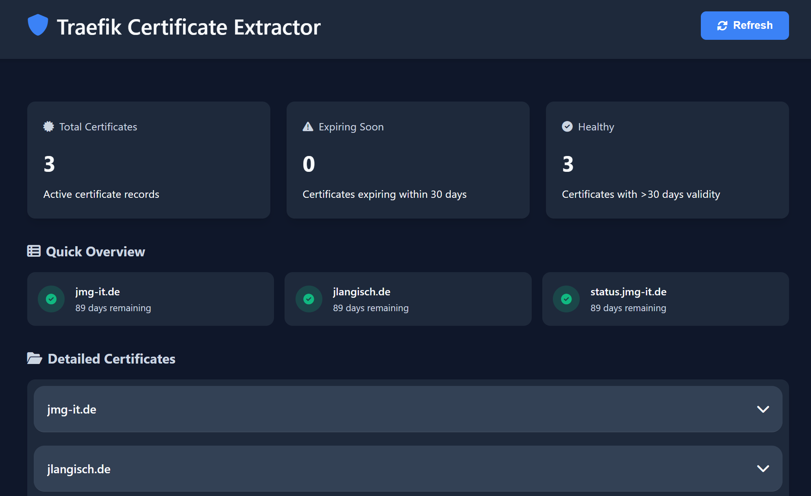

# Traefik Certificate Extractor

[](https://hub.docker.com/repository/docker/jmgitde/traefikcertextractor/general)
[](https://hub.docker.com/repository/docker/jmgitde/traefikcertextractor/general)
[](https://hub.docker.com/repository/docker/jmgitde/traefikcertextractor/general)
[](https://golang.org)
[](https://hub.docker.com/repository/docker/jmgitde/traefikcertextractor/general)
[](https://opensource.org/licenses/MIT)



A tool that extracts and manages TLS certificates from Traefik's acme.json file, providing a convenient web interface to view certificate details and download certificate files.

## Features

- Automatically extracts certificates and private keys from Traefik's acme.json file
- Web-based UI for viewing certificate details:
  - Expiration dates with visual indicators
  - Certificate issuers
  - Subject Alternative Names (SANs)
  - Easy certificate and key downloads
- Periodic certificate extraction (every 8 minutes)
- Multi-architecture support (amd64/arm64)

## Usage

### Docker

The simplest way to use this tool is with Docker:

```bash
docker run -d \
  --name traefik-cert-extractor \
  -p 8080:8080 \
  -v /path/to/traefik/acme.json:/acme/acme.json:ro \
  -v /path/to/store/certs:/extracted-certs \
  jmgitde/traefikcertextractor:latest
```

### Docker Compose

```yaml
version: '3'
services:
  cert-extractor:
    image: jmgitde/traefikcertextractor:latest
    container_name: traefik-cert-extractor
    ports:
      - "8080:8080"
    volumes:
      - /path/to/traefik/acme.json:/acme/acme.json:ro
      - /path/to/store/certs:/extracted-certs
    restart: unless-stopped
```

## Accessing the Web Interface

Once running, access the web interface at:

```
http://localhost:8080
```

## Volumes

- `/acme/acme.json`: Mount Traefik's acme.json file here (read-only recommended)
- `/extracted-certs`: Where certificate and key files will be stored

## Repository

GitHub: [jmgitde/traefikcertextractor](https://github.com/jmgitde/traefikcertextractor)  
Docker Hub: [jmgitde/traefikcertextractor](https://hub.docker.com/repository/docker/jmgitde/traefikcertextractor/general)

## License

MIT License

## Python-predecessor
This project originally used a Python approach, but has been completely overhauled to use 100% Go instead. The migration to Go improved performance, reduced dependencies, and allowed for easier multi-architecture builds. Also, I am transitioning my software to arm, so..
